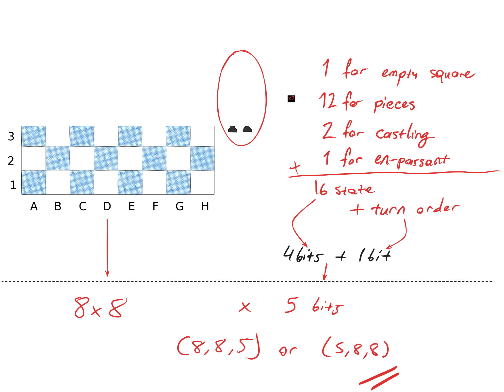
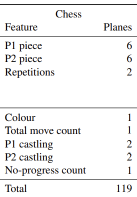
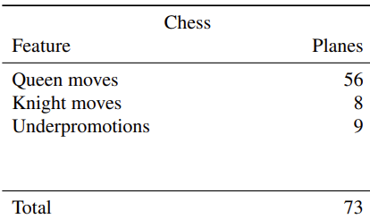

# chess_evaluator
evaluating chess games via DNNs?

### Step 0: took data from [Lichess Database](https://database.lichess.org/#standard_games)

### Step 1: read a pgn file, learn about fen notation: mostly done

### Step 2: how to serialize the board as np array, it is 8x8xc but how many channels == states of the board are there?

- At first, I imagined I would just do a (17, 8, 8) but its just perfect 4+1 bit fit so why not? 
- On second thought, the implementation is easy now so I should test both and compare results!

### Step 3: Okay how do we structure the model? now that we have serialized it, assuming I've saved a processed subset to train.

* [ ] Least likely option: should it generate a new board state? -- probably not, too many illegal states.
* [x] Most likely option: A DNN that predicts board score for probable future boards and an optimizer / board state generator with some arbitrary depth to check.
* [ ] Combine the DNN score with some other known algo like Alpha-Beta pruning
* [ ] Check [Alpha Zero paper](https://arxiv.org/pdf/1712.01815) to see if there is available & viable ideas to implement here 

### Step 4: Checking AlphaZero and Stockfish while basic implementations are going on

#### Notes on AlphaZero
- Uses Monte-Carlo tree search (page 3, paragraph 1)
- ...
- MSE + CE for gradient descent
- They used 5000 1st gen TPU to generate games and 64 2nd gen TPU to train L O L
- 700k steps with batch_size=2^12
- Figure 1. shows it got to 2000 elo around 50k steps, considering it took them 4 hours to process 300k steps, it would at least train for 50 hours to achieve on my setup (RTX 3060)
- Input: constructed of 119 states of which shaped up to be 8x8x(MT+L)
where M=14, L=7 resulting T=8, T sets of M planes with L extra state with T step history of board.

  

- Output: to generate moves they divised all pieces with same capabilities as `queen moves`, `knight moves` and `underpromotions`. Which led to 56 states of (7 * 8) queen moves # of squares and directions to move respectively, 8 for knight moves and 9 for underpromotion of pawns to pawn, knight, bishop or rook with two directions, otherwise queen totaling of 73 states. -> (8x8x73)

  

- TODO: check page 14: **Configuration** paragraph. -> mentions MCTS params, Dirichlet noise, lr and other hyper-params and stats.